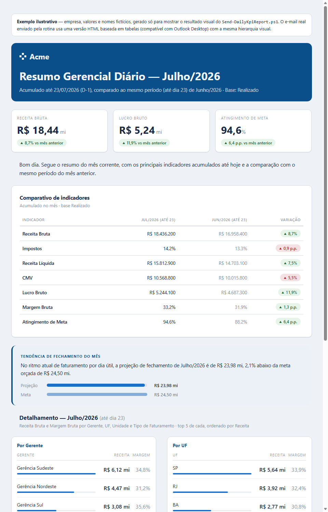
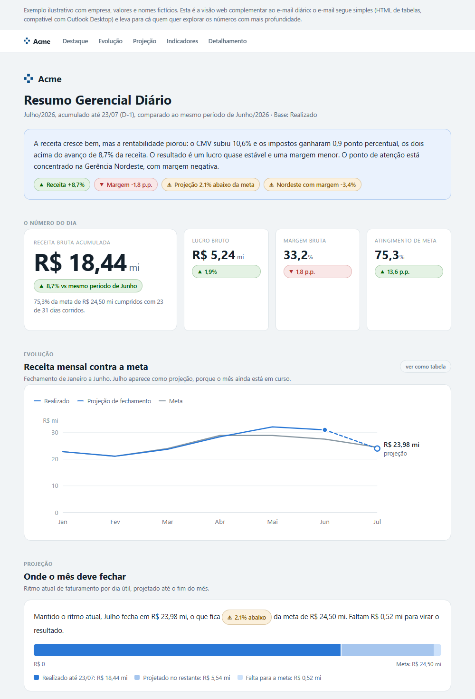

# Resumo Gerencial Diário (Power BI para E-mail)

Rotina que lê os principais indicadores de um relatório do Power BI Service todo dia, monta um resumo em HTML e envia por e-mail, sem precisar abrir o Power BI, sem relatório de "print" manual, sem ninguém copiando número de painel para planilha.

> Nota: este repositório é uma versão de portfólio, anonimizada a partir de uma automação real que construí para uma empresa. Nomes de empresa, e-mails, IDs e valores foram substituídos por dados fictícios. A lógica e a arquitetura são as mesmas que rodam em produção.

## O que o script faz

Todo dia, às 8h da manhã:

1. Autentica no Power BI e consulta o modelo semântico já publicado (via `Execute Queries` REST API), sem tocar no relatório visual
2. Calcula os indicadores do mês corrente (até o dia anterior) comparados ao mesmo período do mês passado
3. Monta um e-mail em HTML com os KPIs principais, uma tabela comparativa e o detalhamento por algumas dimensões de negócio
4. Envia via Microsoft Graph (`sendMail`) para uma lista de destinatários
5. Roda sozinho, via Agendador de Tarefas do Windows (ou qualquer scheduler equivalente)



Veja o resultado completo, interativo, em [sample-email-preview.html](./sample-email-preview.html) (dados fictícios), ou abra a versão publicada: [link do GitHub Pages a definir].

### Painel web complementar

O e-mail em si continua deliberadamente simples (HTML de tabelas, compatível com Outlook Desktop). Para quem quer explorar mais, [dashboard-preview.html](./dashboard-preview.html) é uma versão web complementar dos mesmos dados, com foco em arquitetura da informação e acessibilidade.



Hierarquia de leitura, do geral ao específico:

1. Um bloco de insight que resume em uma frase o que mudou e por quê, seguido de chips com os quatro pontos que merecem atenção
2. Um número protagonista (receita bruta acumulada, em 50px) com três indicadores de apoio ao lado, em vez de cinco cartões de peso visual igual
3. Um gráfico de linha da receita mensal contra a meta, com Janeiro a Junho fechados e Julho como projeção tracejada, já que o mês ainda está em curso
4. Um medidor de projeção que mostra numa única barra o que já foi realizado, o que a projeção acrescenta e o quanto falta para a meta
5. A tabela financeira completa e o detalhamento por dimensão

Decisões de acessibilidade e de visualização:

- Cor nunca carrega informação sozinha: toda variação tem seta (▲ ▼) e as linhas desfavoráveis levam ⚠
- O gráfico tem uma tabela equivalente, acessível por um botão, que é o caminho completo para leitor de tela e para quem não consegue ler o gráfico
- As barras de ranking do detalhamento acompanham a métrica ativa: ao ordenar por margem, elas passam a representar margem, e não a receita
- Tema claro e escuro definidos separadamente, cada um com suas cores validadas contra a superfície correspondente
- Respeita `prefers-reduced-motion` e tem estados de foco visíveis para navegação por teclado

## Por que isso não foi trivial

Um script que "chama uma API e manda e-mail" parece simples até esbarrar em algumas peculiaridades reais de Power BI, Azure AD e Windows PowerShell. Quatro problemas concretos que apareceram construindo isso:

### 1. Row-Level Security bloqueia consultas de Service Principal

A abordagem óbvia, um App Registration (Service Principal) com client-credentials, sem usuário nenhum envolvido, funcionava perfeitamente para datasets sem segurança de linha (RLS). Mas para o dataset com RLS configurada (papéis de segurança por região/gerente), a API `Execute Queries` simplesmente negava a consulta com `401 PowerBINotAuthorizedException`, mesmo com o Service Principal como Admin do workspace. Tentar contornar isso adicionando o Service Principal como membro de um papel de RLS via TMSL/XMLA também não funcionou (o motor do Analysis Services rejeitava a associação de membro para uma identidade de aplicativo puro).

A solução foi trocar de autenticação: em vez de um Service Principal puro, o script autentica como um usuário real (que já tem acesso irrestrito ao dataset), via OAuth Device Code Flow, um login único que gera um *refresh token* de longa duração, renovado sozinho a cada execução. RLS deixa de ser um problema porque a identidade que consulta já tem o acesso certo.

### 2. Um bug de codificação escondido no Windows PowerShell 5.1

Depois de resolver o RLS, as consultas com medidas que tinham acento no nome (`Receita Líquida`, `Orçado`, `Tendência`) voltavam com erro `400 Bad Request: Invalid value`, mas só quando o texto estava corretamente acentuado. Uma versão do mesmo texto com os acentos "quebrados" (mojibake) funcionava.

A causa: `Invoke-RestMethod` no Windows PowerShell 5.1 codifica o corpo da requisição (e decodifica a resposta) usando o codepage ANSI do sistema por padrão, mesmo com `Content-Type: application/json`. A correção foi parar de usar `Invoke-RestMethod` para essa chamada e montar a requisição manualmente com `HttpWebRequest`, forçando UTF-8 explicitamente tanto no envio quanto na leitura da resposta.

### 3. Regra de data "D-1 útil"

O relatório nunca usa os dados do próprio dia (parciais/incompletos). Ele sempre usa o fechamento do dia anterior, exceto quando o envio cai numa segunda-feira, caso em que usa a sexta-feira anterior (para manter a mesma quantidade de dias úteis na comparação entre o mês atual e o mês anterior).

### 4. Verde e vermelho não bastam (nem para quem enxerga bem)

Ao montar o painel web complementar, testei a paleta de cores de status (favorável/atenção/desfavorável) com o mesmo tipo de checagem que qualquer paleta categórica deveria passar: distância de cor sob simulação de daltonismo (protanopia e deuteranopia). O primeiro trio que tentei, um verde, um âmbar e um vermelho nos tons "óbvios" de semáforo, ficava com distância de cor praticamente zero entre os pares sob simulação: para quem tem esses tipos de daltonismo, as três cores colapsam quase no mesmo ponto. Troquei o verde por um verde-azulado (teal) para tirar o par do eixo de confusão vermelho-verde, e mantive o que já era estrutural desde o início: a cor nunca é a única pista, toda variação também tem uma seta (▲/▼) e, no painel web, um ícone de atenção (⚠) nas linhas desfavoráveis.

## Canais de envio

O parâmetro `-Canais` controla por onde o resumo sai, pode combinar mais de um: `-Canais Email,Teams,WhatsApp`. Cada canal tem sua própria complexidade de configuração:

| Canal | Configuração necessária | Complexidade |
|---|---|---|
| E-mail | App Registration com `Mail.Send` (Microsoft Graph), consentimento de admin | Baixa |
| Teams | Um Incoming Webhook criado direto no canal do Teams (menu "Conectores"), sem precisar de App Registration | Baixa |
| WhatsApp | Conta no WhatsApp Business Platform (Meta), Phone Number ID, e um template de mensagem pré-aprovado no Meta Business Manager | Alta |

O envio ao Teams usa um card simples (formato `MessageCard`) com os KPIs principais, sem o detalhamento completo por dimensão.

O WhatsApp é o canal mais trabalhoso de configurar de verdade: a API oficial (WhatsApp Business Platform / Cloud API da Meta) só permite que uma empresa inicie a conversa (fora de uma janela de atendimento de 24h) usando um "template de mensagem" cadastrado e aprovado previamente no Meta Business Manager, com um número fixo de variáveis de texto. Não dá para mandar HTML nem texto livre nesse cenário. O script já vem preparado para chamar um template com 4 parâmetros (Receita Bruta, Lucro Bruto, Atingimento de Meta e Tendência), mas o template em si precisa existir e estar aprovado antes de rodar. As variáveis de ambiente `WHATSAPP_PHONE_NUMBER_ID` e `WHATSAPP_TEMPLATE_NAME`, mais o Access Token em `.secrets\whatsapp.env`, controlam esse canal.

## Stack

- PowerShell (Windows PowerShell 5.1): orquestração, HTTP, formatação
- Power BI REST API (`Execute Queries`): consulta DAX direta ao modelo semântico publicado
- Microsoft Graph API (`sendMail`): envio do e-mail
- Microsoft Teams (Incoming Webhook): envio de card resumido ao canal
- WhatsApp Business Platform (Cloud API da Meta): envio via template de mensagem aprovado
- DAX: reaproveita as medidas já publicadas no modelo (nenhuma lógica de negócio duplicada em código)
- Agendador de Tarefas do Windows: disparo diário

## Como configurar (visão geral)

1. Crie um App Registration no Azure AD com:
   - Permissão delegada `Dataset.Read.All` (Power BI) para consulta com autenticação de usuário
   - Permissão de aplicativo `Mail.Send` (Microsoft Graph), com consentimento de admin, para o envio
2. Habilite "Allow service principals to use Power BI APIs" no Admin Portal do Power BI, se for usar Service Principal em algum ponto
3. Configure as variáveis de ambiente do script: `PBI_TENANT_ID`, `PBI_CLIENT_ID`, `PBI_WORKSPACE_ID`, `PBI_DATASET_ID`, `PBI_SENDER_UPN`
4. Faça o login único (Device Code Flow) para gerar o refresh token e salve em `%USERPROFILE%\.secrets\pbi-delegated.env`
5. Salve o Client Secret em `%USERPROFILE%\.secrets\pbi.env`
6. Agende `Send-DailyKpiReport.ps1` no Agendador de Tarefas do Windows, diariamente

## Adaptando para o seu próprio modelo (se você der fork)

Uma parte da configuração acima é só credencial/infraestrutura (variáveis de ambiente, secrets, agendamento) e funciona igual pra qualquer dataset. A outra parte é específica do modelo de dados e precisa ser editada à mão, porque o script foi escrito em cima de nomes reais de tabelas, colunas e medidas do modelo original. Um fork "puro" (só trocando as variáveis de ambiente) não vai funcionar até você fazer esses ajustes.

### O que é só configuração (não precisa mexer no código)

- `PBI_TENANT_ID`, `PBI_CLIENT_ID`, `PBI_WORKSPACE_ID`, `PBI_DATASET_ID`, `PBI_SENDER_UPN` (variáveis de ambiente)
- Lista de destinatários (parâmetro `-Destinatarios`)
- Client Secret / Refresh Token (arquivos em `.secrets\`)
- Horário do agendamento

Como achar o Workspace ID e o Dataset ID: abra o relatório no navegador dentro do Power BI Service. O Workspace ID é o primeiro GUID na URL (`.../groups/<WORKSPACE_ID>/reports/...`). Para o Dataset ID, abra o item do modelo semântico (não o relatório) nas configurações do workspace, vai aparecer na URL como `.../datasets/<DATASET_ID>/...`.

### O que é específico do seu modelo (precisa editar o script)

No arquivo `Send-DailyKpiReport.ps1`, as strings DAX dentro de `$summaryQuery` e `New-BreakdownQuery` referenciam nomes reais de tabelas/colunas/medidas do modelo original (`Fato_1[Gerente]`, `Dim_Calendario[Data]`, `[Receita Bruta (Realizado) 2]` etc.). Isso precisa ser trocado pelos equivalentes do seu modelo:

1. Identifique (ou crie) as medidas do seu modelo para cada indicador que você quer no resumo: receita, margem, meta orçada, etc. Idealmente, use medidas que já existem no seu modelo (para não duplicar lógica de negócio em código), do jeito que o valor real venha em unidade "cheia" (reais, não milhares). Se sua medida divide por 1000 para exibição no relatório visual, crie uma segunda versão sem essa divisão só para a automação (foi o que fizemos aqui, as medidas com sufixo `2` no modelo original).
2. Teste uma consulta DAX isolada primeiro, antes de mexer no script inteiro. Um exemplo mínimo pra validar autenticação e nome de medida:
   ```
   EVALUATE ROW("Teste", [NomeDaSuaMedida])
   ```
   Envie isso via `POST /v1.0/myorg/groups/{workspaceId}/datasets/{datasetId}/executeQueries` e confirme que volta um número, antes de integrar ao script completo.
3. Troque os nomes de tabela/coluna nas 4 quebras de detalhamento (`Fato_1[Gerente]`, `Fato_1[UF]`, `Fato_1[Unidade]`, `Fato_1[Tipo Faturamento]`) pelas dimensões que fizerem sentido no seu negócio, pode ser por vendedor, por região, por produto, por canal, o que for relevante pra você. Ajuste também os rótulos correspondentes no HTML (`Breakdown-TableHtml "Por Gerente" ...` etc.).
4. Se o seu dataset não tiver Row-Level Security, você pode simplificar bastante: use um Service Principal com client-credentials puro (sem o Device Code Flow), é mais simples de manter porque não depende de um usuário/refresh token. O RLS foi o motivo de precisarmos da autenticação delegada aqui; sem RLS, esse problema não existe.
